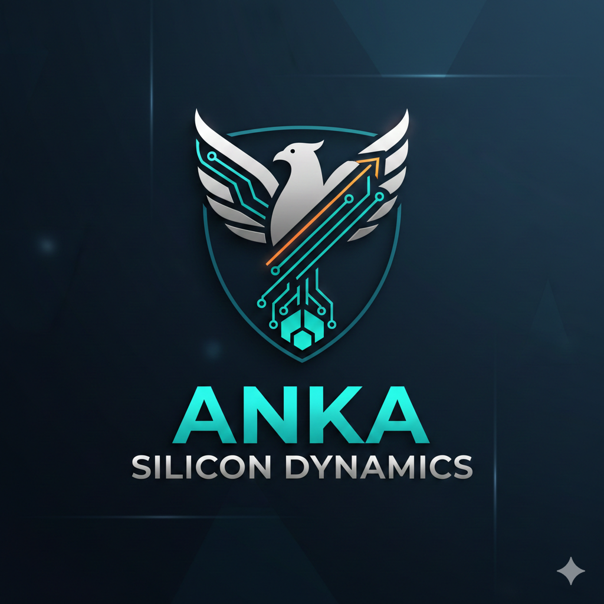



  

# 🦅 Anka Silicon Dynamics: Silikon Temelli Zeka Simülasyonu

**"Donanımı Beklemiyoruz, Donanım Geldiğinde Üzerinde Koşacak Aklı İnşa Ediyoruz."**

ANKA-LLM; Türkiye'nin kendi GPU'sunu ve yapay zeka işlemcisini (NPU) üreteceği güne kadar, eldeki kısıtlı kaynaklarla dünya devlerine karşı **"Asimetrik Üstünlük"** sağlama stratejisidir.

---

## 🏔️ Stratejik Vizyon
Türkiye’nin "Büyük Hazırlık" planı ve asimetrik üstünlük stratejisi hakkında detaylı bilgi için:
👉 **[VISION.md](VISION.md)**

---

## 📂 Proje Yapısı ve Dokümantasyon

### 📊 Bölüm 1: Veri Madenciliği ve Damıtma
Milyar dolarlık donanımlara ihtiyaç duymadan, "Knowledge Distillation" teknikleriyle yüksek zekalı modeller eğitme planı.
👉 **[VERI_DAMITMA_PLANI.md](docs/VERI_DAMITMA_PLANI.md)**

### 🛰️ Bölüm 2: Milli NPU Yazılım Gereksinimleri
Yerli yapay zeka işlemcisi (NPU) için teknik şartname ve yazılım katmanı mimarisi.
👉 **[MILLI_NPU_YAZILIM_GEREKSINIMLERI.md](docs/MILLI_NPU_YAZILIM_GEREKSINIMLERI.md)**

### 🛡️ Bölüm 3: Katılım ve Topluluk
Milli AI davasına nasıl katkı sağlayabileceğinizi öğrenin.
👉 **[CONTRIBUTING.md](CONTRIBUTING.md)**

---

## 🛠️ Teknik Altyapı (Skeleton)

Projenin teknik temelleri atılmaya başlanmıştır:

*   **[src/tokenizer/](src/tokenizer/):** Türkçe için yüksek verimli morfolojik tokenizer çalışmaları.
*   **[src/distillation/](src/distillation/):** Bilgi damıtma ve sentetik veri üretim boru hatları.

---

## 📈 Hedef: "Sıfırıncı Gün" Hazırlığı
Biz o güne kadar en zeki, en verimli ve en rafine algoritmaları geliştirerek; donanım bariyeri kalktığı an dünyayı geçmeye hazır olacağız.

**"Yazılımda zayıf olanın, donanımda güçlü olması sadece bir satın almadır; yazılımda güçlü olanın donanıma kavuşması ise bir devrimdir."**

---
© 2025 ANKA-LLM Team | [LICENSE](LICENSE)

